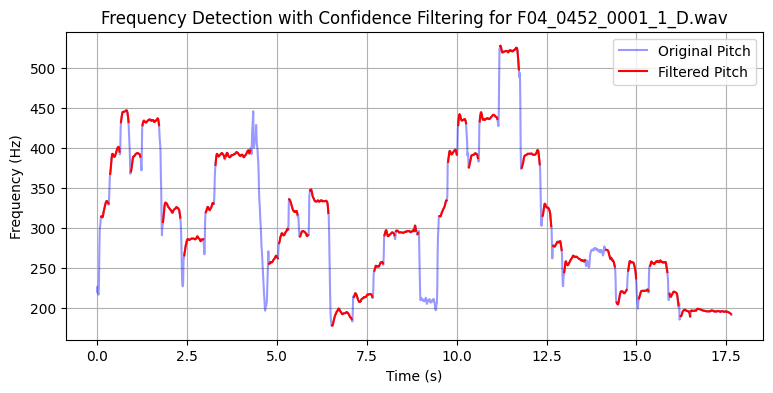
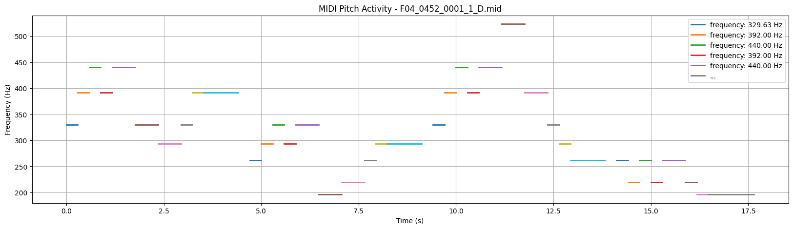
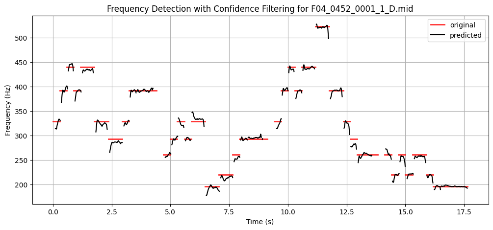
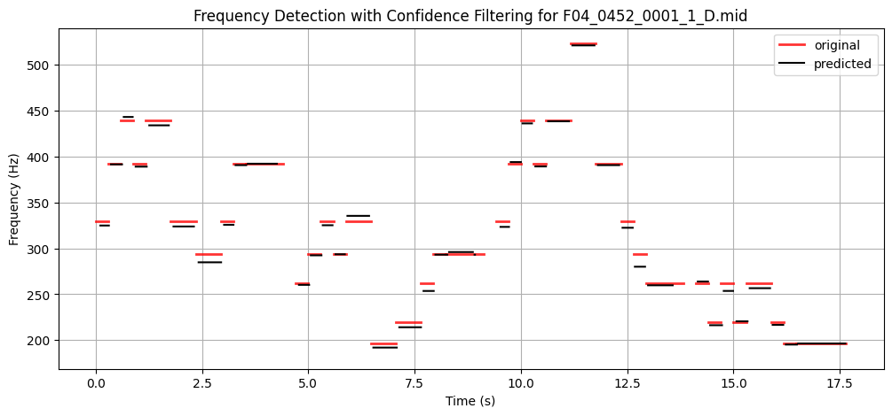
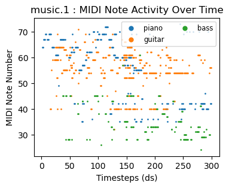
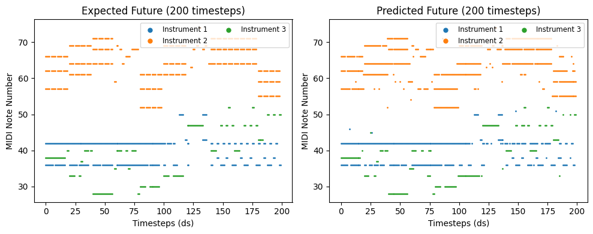
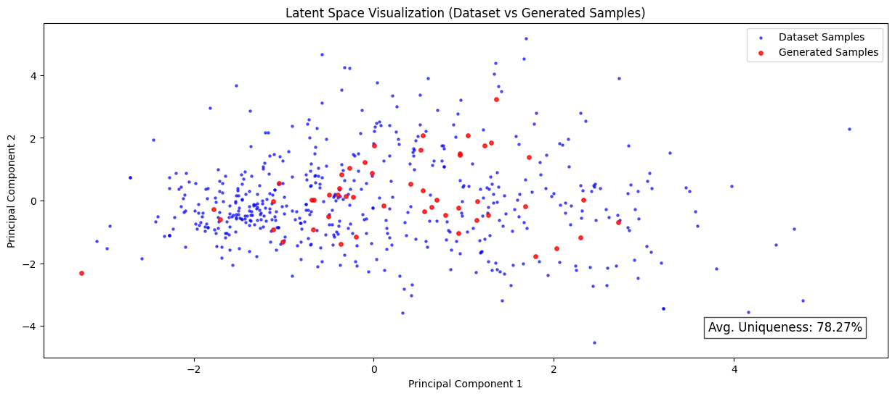
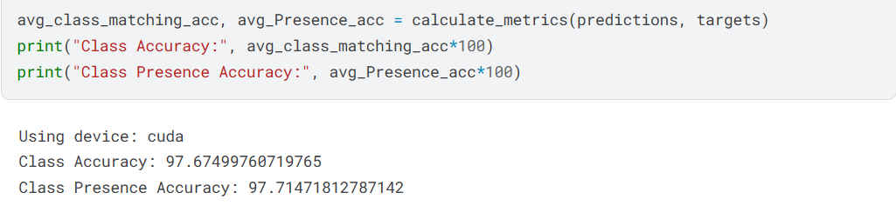

# Project Documentation

Welcome to the project! Below are links to the implementation documentation for the backend, machine learning models and frontend:

- 📌 **Backend Documentation**: [Go here](backend/README.md)
- 📌 **Machine Learning Models Documentation**: [Go here](backend/machine_learning_models/Readme.md)
- 🎨 **Frontend Documentation**: [Go here](frontend/README.md)

Each section contains detailed information about dependencies, and usage.

Happy coding! 🚀

# Generate Music from Humming

This documentation provides an overview of the "Generate Music from Humming" application. These images depict different stages of music generation, pitch detection, and model metrics.

---

## Filtering Detected Pitches
Filtering is the first step in the pitch detection pipeline, where unwanted frequencies are removed to enhance accuracy.

---

## Original Annotations
This image shows the original pitch annotations, which serve as a ground truth for evaluating the pitch detection model.

---

## Comparing Original and Detected Pitches
This comparison helps in analyzing the accuracy of the detected pitches against the original annotations.

---

## Smoothened Pitches
After detecting pitches, they are smoothened to improve the overall melody flow.

---

## Polyphonic Music
This plot represents the polyphonic generated music, showcasing multiple notes played simultaneously.

---

## CLSTM Predictions
The Conditional LSTM (CLSTM) model's predictions for the music sequence are displayed here.

---

## CVAE Metrics

---

## CLSTM Metrics

